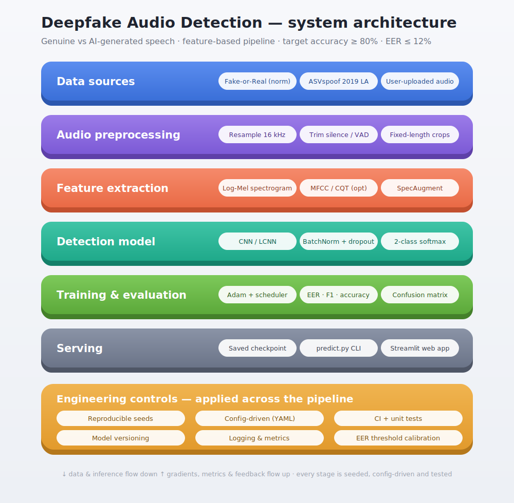
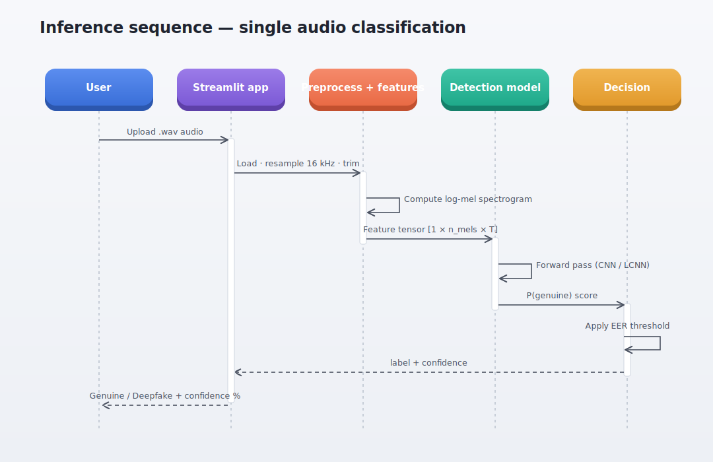
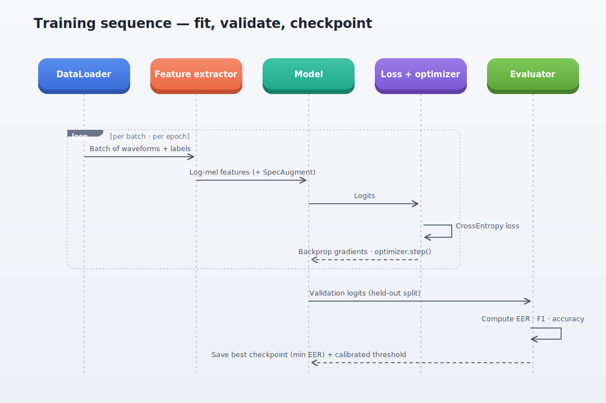

# Deepfake Audio Detection 🎙️

Detecting whether a speech recording is **Genuine (Human)** or **Deepfake (AI-Generated)**.

> **MARS Open Projects 2026 — Problem Statement 2.**
> Verification targets: **Accuracy ≥ 80%**, **EER ≤ 12%**, **F1 ≥ 80%**, **per-class accuracy ≥ 75%**.

A production-grade, config-driven pipeline: audio preprocessing → log-mel features → CNN / LCNN
classifier → EER-calibrated decision → CLI + Streamlit serving. The notebook, the scripts and the
web app all import the **same** library code in `src/deepfake_audio/`.

---

## Architecture



The pipeline is layered: genuine and synthetic speech enter at the top, flow down through
preprocessing, feature extraction, the detection model, training/evaluation and serving, while
engineering controls (seeding, config, tests, versioning, threshold calibration) wrap every stage.

### Inference flow



### Training flow



---

## Methodology

1. **Preprocessing** — load mono audio, resample to 16 kHz, trim leading/trailing silence,
   and crop/pad to a fixed 4-second analysis window (random crop in training, centre crop at
   inference) for batch-friendly fixed-shape tensors.
2. **Feature extraction** — per-utterance-normalised **log-mel spectrograms**
   (80 mels, 1024-pt FFT, 256 hop). MFCC is available via config. **SpecAugment**
   (one frequency + one time mask) is applied during training only.
3. **Model** — a compact 2-D **CNN** (four conv blocks → global pool → linear) by default, or an
   **LCNN** with Max-Feature-Map activations (a standard audio anti-spoofing baseline). Selectable
   with `model.name`.
4. **Training** — Adam + cosine LR, cross-entropy loss, **EER measured every epoch**, early
   stopping on validation EER. The best checkpoint stores the model weights *and* the decision
   threshold calibrated at the EER operating point.
5. **Evaluation** — accuracy, **EER**, macro-F1, per-class accuracy and the confusion matrix,
   each checked against the competition thresholds and written to `reports/metrics.md`.
6. **Serving** — `scripts/predict.py` for single files and a Streamlit app that returns the label
   plus a confidence score and shows the spectrogram.

**Label convention:** `genuine (human) = 1`, `deepfake (AI-generated) = 0`. Scores are
`P(genuine)`, with genuine as the positive class for the EER.

---

## Repository layout

```
deepfake-audio-detection/
├── README.md
├── requirements.txt · pyproject.toml · Makefile · LICENSE
├── config/config.yaml            # single source of truth for all hyperparameters
├── data/                         # dataset goes here (git-ignored); see data/README.md
├── docs/                         # architecture.svg, sequence-inference.svg, sequence-training.svg
├── notebooks/
│   └── deepfake_audio_detection.ipynb   # full runnable pipeline
├── models/                       # trained checkpoints (best_model.pt)
├── reports/                      # metrics.md + figures/confusion_matrix.png
├── src/deepfake_audio/           # installable library
│   ├── config.py
│   ├── data/      (dataset.py, loader.py)
│   ├── features/  (extract.py)            # log-mel / MFCC + SpecAugment
│   ├── models/    (cnn.py, lcnn.py, factory.py)
│   ├── training/  (train.py, evaluate.py) # EER validation, calibration, reporting
│   ├── inference/ (predict.py)
│   └── utils/     (audio.py, metrics.py, seed.py)
├── scripts/       (train.py, evaluate.py, predict.py, download_data.py)
├── app/streamlit_app.py
├── tests/         (test_features.py, test_metrics.py, test_model.py)
└── .github/workflows/ci.yml      # lint + tests on every push
```

---

## Quickstart

```bash
# 1. Install
make setup                       # pip install -r requirements.txt && pip install -e .

# 2. Get the data (see data/README.md for the Kaggle token step)
make data                        # prints the download commands
#    -> point config/config.yaml : data.root at the for-norm folder

# 3. Train (checkpoints the best model by validation EER)
make train

# 4. Evaluate on the test split -> reports/metrics.md + confusion matrix
make evaluate

# 5. Classify a new file
make predict AUDIO=path/to/sample.wav

# 6. Run the web app
make app
```

Everything is also runnable directly, e.g. `python scripts/train.py --config config/config.yaml`.

---

## Configuration

All behaviour is driven by `config/config.yaml` — sample rate, window length, feature type and
sizes, SpecAugment, model choice, and the full training schedule. Switch the model with one line:

```yaml
model:
  name: lcnn      # cnn | lcnn
```

---

## Results

Run `make evaluate` to populate `reports/metrics.md`. The report renders as a table and flags each
metric PASS/FAIL against the thresholds:

| Metric | Required |
|---|---|
| Overall accuracy | ≥ 80% |
| Equal Error Rate (EER) | ≤ 12% |
| F1 score (macro) | ≥ 80% |
| Per-class accuracy (each class) | ≥ 75% |

The confusion matrix is saved to `reports/figures/confusion_matrix.png`.

---

## Deliverables map (Problem Statement §6)

| Required deliverable | Where it lives |
|---|---|
| `.ipynb` with full running code | `notebooks/deepfake_audio_detection.ipynb` |
| Trained model | `models/best_model.pt` (after `make train`) |
| Script to test new audio | `scripts/predict.py` |
| Performance report (acc, EER, F1, confusion matrix) | `reports/metrics.md` + `reports/figures/` |
| Preprocessing / feature / architecture description | this README + `docs/` diagrams |
| Clear `README.md` (description, methodology, pipeline, metrics) | this file |
| Streamlit web app (audio in → label + confidence) | `app/streamlit_app.py` |
| Demo video (~2 min) | record a screen capture of the running app — see note below |

**Demo video:** start the app (`make app`), upload one genuine and one deepfake clip, and screen-record
the prediction + confidence for ~2 minutes. (The repository ships the app; the recording is produced
at submission time.)

---

## Testing & CI

```bash
make test     # pytest: metrics (EER), features (shapes/normalisation), model forward passes
make lint     # flake8
```

GitHub Actions runs lint + tests on every push (`.github/workflows/ci.yml`).

---

## Notes on generalisation

- Train on `for-norm`; optionally fine-tune or cross-test against **ASVspoof 2019 LA** to probe
  generalisation to unseen synthesis methods.
- The EER threshold is calibrated on validation data and stored in the checkpoint, so inference
  uses a principled operating point rather than a naive 0.5 cut.
- SpecAugment, silence trimming and per-utterance normalisation reduce overfitting to recording
  conditions rather than to genuine-vs-synthetic cues.

## License

MIT — see [LICENSE](LICENSE).
